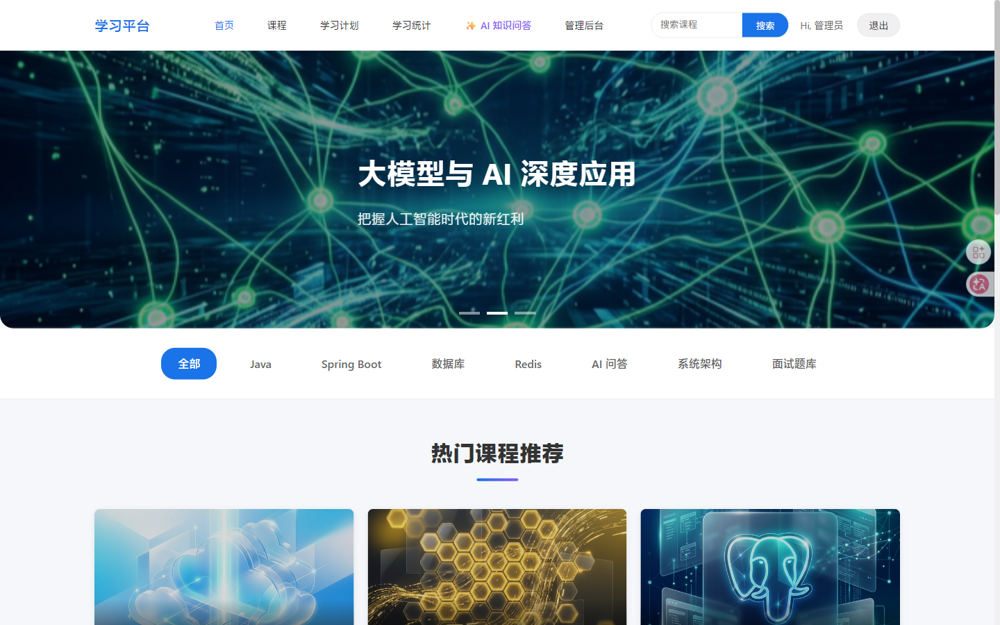
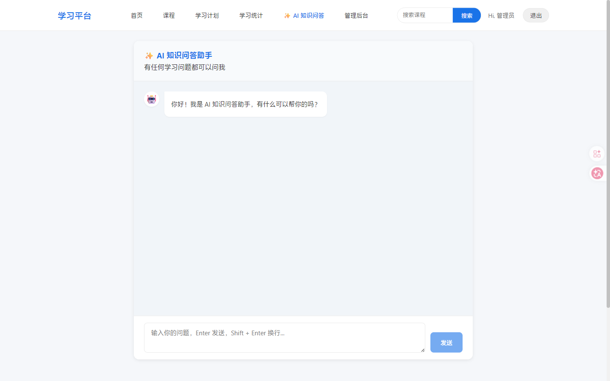
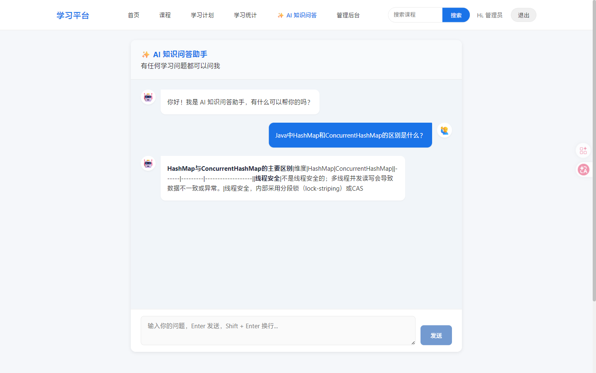
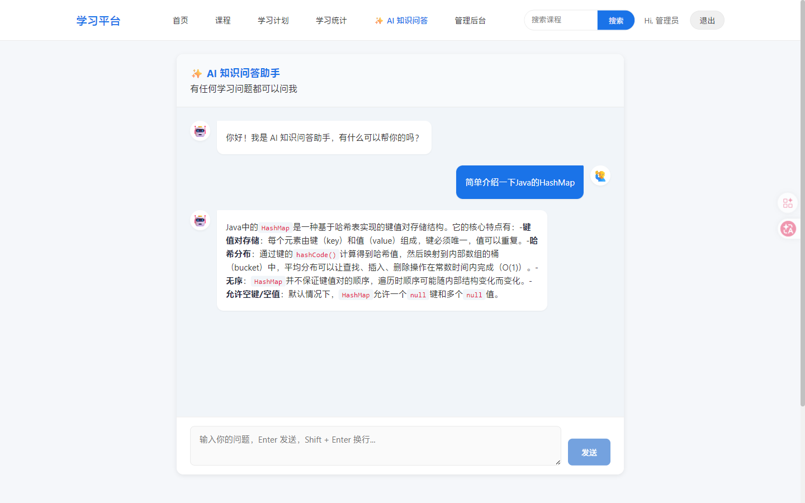
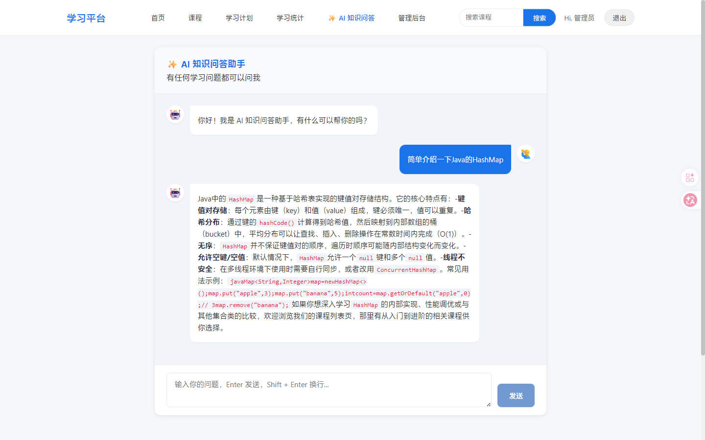
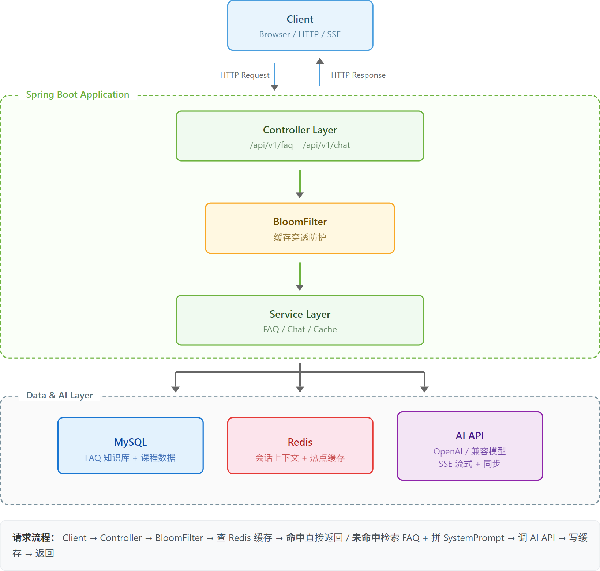

# Knowledge QA Platform

> 基于 Spring Boot + Spring AI 的知识库智能问答平台


---

## 界面预览

### 系统主页
<div align="center">
  
  <br><b>学习平台主页（含 AI 助手入口）</b>
</div>

### 智能助手交互
<table>
  <tr>
    <td align="center"><br><b>提出问题</b></td>
    <td align="center"><br><b>AI 实时响应</b></td>
  </tr>
  <tr>
    <td align="center"><br><b>多轮会话 - 轮次一</b></td>
    <td align="center"><br><b>多轮会话 - 轮次二</b></td>
  </tr>
</table>

---

## 项目简介

将传统在线学习平台改造为 AI 驱动的知识库问答系统。在保留原有 13 个 CRUD 接口的基础上，新增了 FAQ 知识库、AI 智能问答、SSE 流式传输、多轮会话管理等功能模块。

---

## 功能模块

| 模块 | 功能 | 技术要点 |
|------|------|----------|
| **FAQ 知识库** | CRUD + 关键词搜索 | Spring JDBC `JdbcTemplate`，SQL LIKE 模糊匹配，按热度排序 |
| **同步问答** | 单轮 AI 问答 | Spring AI / OkHttp 调用大模型 API，15s 超时降级兜底 |
| **SSE 流式接口** | 逐 Token 实时推送 | `SseEmitter`，流式调用模型 API，`[DONE]` 标记 + graceful cleanup |
| **多轮会话** | 滑动窗口上下文管理 | Redis List 存储会话，LTRIM 保留最近 8 轮，TTL 30min 自动过期 |
| **热点缓存** | 高频问题缓存加速 | Redis String `Cache Aside` 模式，TTL 1h |
| **布隆过滤器** | 缓存穿透防护 | Guava `BloomFilter`，预期 10000 条，误判率 0.01 |
| **工程质量** | 统一响应 + 异常处理 | `Result<T>` 封装、`@RestControllerAdvice`、参数校验 |

---

## 架构说明

<div align="center">
  
</div>

**请求流程**：Client → Controller → BloomFilter → 查 Redis 缓存 → **命中**直接返回 / **未命中**检索 FAQ + 拼 SystemPrompt → 调 AI API → 写缓存 → 返回

---

## 快速启动

### 环境要求
- JDK 17+
- Maven 3.8+
- MySQL 8.0+
- Redis 7+

### 环境变量配置

```bash
# 设置环境变量（或修改 application.yml）
export SPRING_DATASOURCE_URL=jdbc:mysql://localhost:3306/knowledge_qa
export SPRING_DATASOURCE_USERNAME=root
export SPRING_DATASOURCE_PASSWORD=your_password
export AI_API_KEY=your_api_key
export AI_BASE_URL=https://api.openai.com
export AI_MODEL=gpt-3.5-turbo
```

### 运行服务

```bash
# 1. 导入数据库
mysql -u root -p < src/main/resources/sql/faq.sql

# 2. 启动项目
mvn spring-boot:run
```

### 前端启动

项目前端分为两部分，均位于 `frontend/` 目录下：

| 前端 | 目录 | 说明 |
|------|------|------|
| **用户端** | `frontend/web` | 学习平台主页、AI 智能问答 |
| **管理后台** | `frontend/admin` | 课程管理、数据统计 |

```powershell
# 启动用户端前端
cd frontend/web
pnpm install
pnpm dev
```
👉 **用户端首页**：`http://localhost:4000`（启动后会自动打开浏览器）

### 测试账号

| 角色 | 用户名 | 密码 | 说明 |
|------|--------|------|------|
| 管理员 | `admin` | `admin123` | 可进入管理后台 |
| 学员 | `student` | `123456` | 体验购买、学习计划等功能 |

### 本地访问说明（后端）
- **健康检查地址**：`http://localhost:3001/health`
- **说明**：后端启动成功后可访问此地址验证服务状态。

---

## API 接口列表

| Method | Endpoint | Description |
|--------|----------|-------------|
| `GET` | `/api/v1/faq` | 获取 FAQ 列表 |
| `POST` | `/api/v1/faq` | 新增 FAQ |
| `PUT` | `/api/v1/faq/{id}` | 更新 FAQ |
| `DELETE` | `/api/v1/faq/{id}` | 删除 FAQ |
| `GET` | `/api/v1/faq/search?keyword=xxx` | 搜索 FAQ |
| `POST` | `/api/v1/chat/ask` | 同步问答 |
| `GET` | `/api/v1/chat/stream?message=xxx&sessionId=xxx` | SSE 流式问答 |

---

## 课程管理模块（todo）

> 本项目同时包含一个课程管理子系统，提供课程（Course）的增删改查 REST API，支持排序、分页、过滤、缓存等功能。

### 接口定义

| Method | Endpoint | Description |
|--------|----------|-------------|
| `GET` | `/health` | 健康检查 |
| `GET` | `/api/courses` | 课程列表（支持分页、过滤、排序） |
| `GET` | `/api/courses/{id}` | 课程详情 |
| `POST` | `/api/courses` | 创建课程 |
| `PATCH` | `/api/courses/{id}` | 更新课程 |
| `DELETE` | `/api/courses/{id}` | 删除课程 |

- 端口：`3001`
- 返回结构：`{ code, message, data, timestamp }`
- 失败也返回 HTTP 200（统一返回格式）
- Redis 缓存可选：不配 Redis 就自动降级；Redis 挂了也不影响服务可用

### 课程管理本地启动

#### 1) 配置 MySQL 环境变量（PowerShell）

```powershell
cd D:\AtoC\dev\soft_projects\knowledge-qa-platform
$env:MYSQL_HOST="127.0.0.1"
$env:MYSQL_PORT="3306"
$env:MYSQL_USER="root"
$env:MYSQL_PASSWORD="your_password"  # 替换为你的 MySQL 密码
$env:MYSQL_DATABASE="design"
```

如果数据库不存在，需要先创建：

```sql
CREATE DATABASE IF NOT EXISTS design;
```

Java 应用启动时会自动创建 `courses` 表（基于 `src/main/resources/schema.sql`）。

#### 2) 可选：配置 Redis（不配也能跑）

```powershell
$env:REDIS_URL="redis://127.0.0.1:6379"
$env:REDIS_TTL_SECONDS="15"
```

#### 3) 启动项目

```powershell
# 方式 1：直接运行
mvn -q spring-boot:run

# 方式 2：使用启动脚本（会检查 JDK / MYSQL 环境变量）
.\run-dev.ps1
```

### 课程管理功能验证

- 健康检查：`http://localhost:3001/health`
- 创建课程：
  ```bash
  curl -X POST http://localhost:3001/api/courses \
    -H "Content-Type: application/json" \
    -d '{"title":"Spring Boot 实战","summary":"从入门到精通","description":"详细讲解 Spring Boot 核心特性","status":0,"priceCents":9900,"teacherName":"张老师"}'
  ```
- 查询课程（按价格排序）：
  ```bash
  curl "http://localhost:3001/api/courses?sortBy=price&limit=10"
  ```

### 技术栈与测试
> ✅ 2026-04-24 已完成 Spring Boot 2.7.18 → 3.2.0 升级，完整 jakarta 迁移

- **核心组件**：Spring Boot 3.2.0, Spring JDBC, MySQL 8.x, Redis (可选)
- **单元与集成测试**：JUnit 5 + MockMvc

```powershell
# 运行所有测试
mvn clean test

# 只运行单元测试
mvn test -Dtest=CourseControllerTest

# 只运行集成测试（需要本地具有 MySQL 配置环境）
mvn test -Dtest=CourseIntegrationTest
```

---

## License

MIT License
